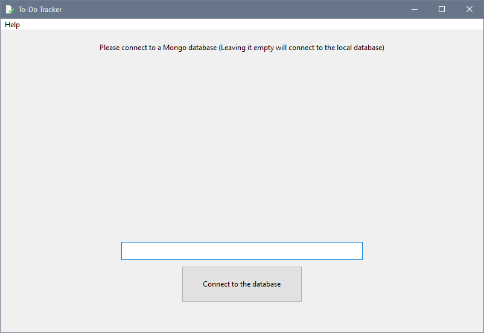
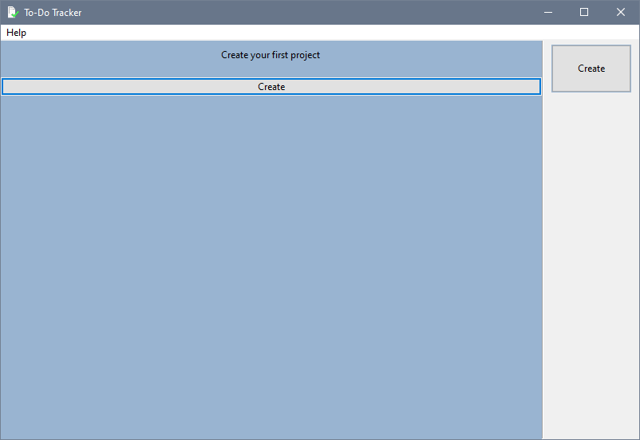
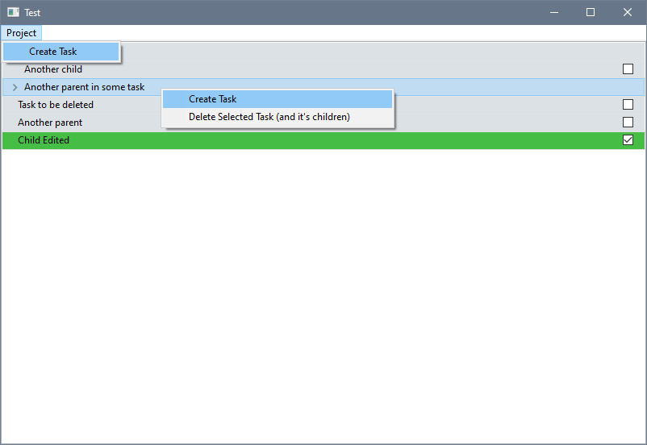
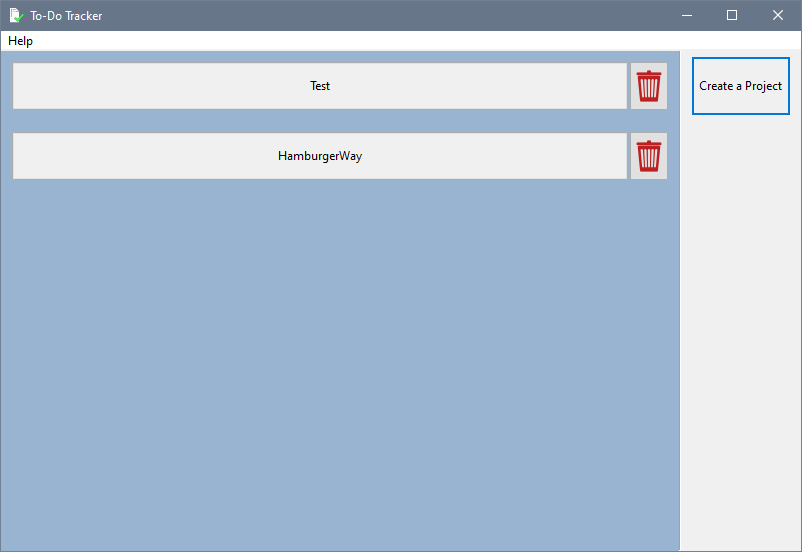
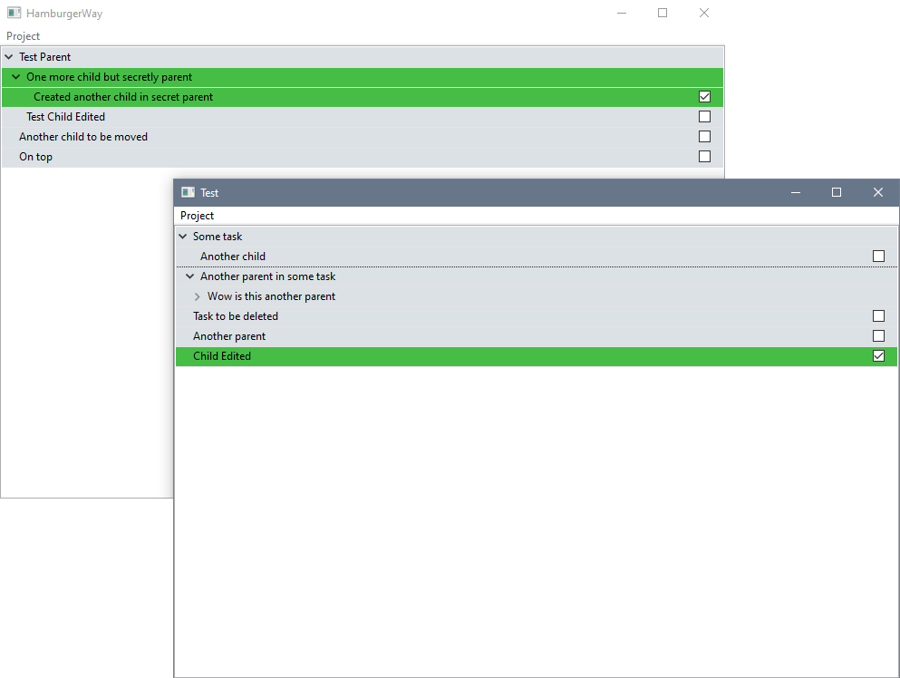

# To Do Tracker
A simple desktop app to track your progress and things to do

I have made this project to learn more about C++ and MongoDB while creating useful app to keep track of my progress in projects on mongoDB rather than notepad.
You have to install [mongoDB community](https://www.mongodb.com/products/self-managed/community-edition) if you want to use this app locally.

## How To Use
### Creating the first project
1. Enter the mongoDB url to use remotely, or leave it empty to use it locally **requires mongoDB community**. 
2. Create a project for the first time. 
3. Open the created project and create a task either right clicking or "Project/Create Task". 
4. You are ready to go.

### Modifying or deleting to do items
- You can create sub to-do items by right clicking desired parent to-do item or first selecting (left mosue button) the desired parent then selecting "Project/Create Task".
- You can drag and drop to-do items to change its parent by holding left mouse button.
- You can right click to-do item to delete it and its children.
- You can double left click an item to modify it.

### Useful tips
- Holding "Left Shift" while expanding/collapsing an item will expand/collapse all the children items.

## Features
- Nested to-do categories.
- Drag and drop to-do item.
- Modify to-do item.
- To-do Tracker will minimized to app status when closed.
- Supports (Only) MongoDB, local or remote (remote not tested yet).
- Work in multiple projects at once.  

## Technologies
- Interface made with [wxWidget](https://www.wxwidgets.org/).
- [MongoDB](https://www.mongodb.com/) used to store and modify to-dos.

## Known Issues
- Sometimes to-do item move below the drop position while dragging.
- Order of the top most to-do items can't be changed due to save system.

## To-Dos
- Add more save-load options for offline usage.
- Add support for multiple selection.
- Add support to save top-most items order.
- Save mongoDB url (if entered any) for the next time the app starts.
- Add release build for other platforms.
- Add support to renaming project names.
